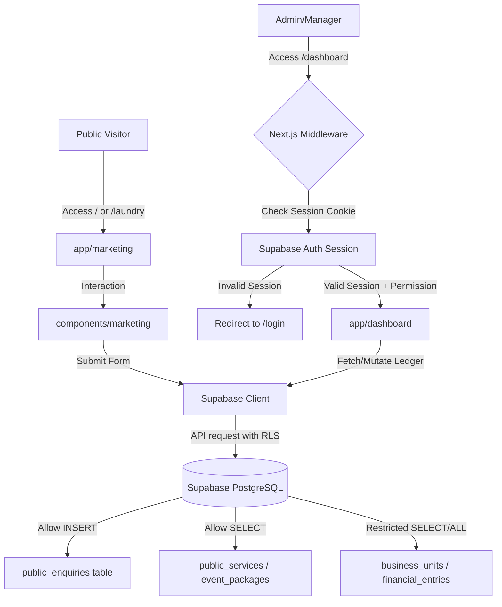

# Architecture Documentation for REOL Nexus

This document details the system design, folder architecture, data flow, and key design decisions for the **REOL Nexus** monorepo workspace.

---

## 1. System Overview

REOL Nexus is designed as a modular monorepo that houses the private financial dashboard (internal management console) and the public marketing storefront for **REOL GLOBAL SOLUTIONS LIMITED** (covering its Event Center, Eatery, and Laundry business units).

### Tech Stack
* **Build System**: [Turborepo](https://turbo.build) (`v2.10.1`) with `pnpm` workspaces (`v9.0.0`)
* **Framework**: Next.js (`v16.2.0`) utilizing React (`v19.2.0`) and the App Router
* **Styling**: TailwindCSS (`v4.3.2`) with PostCSS
* **Database & Auth**: [Supabase](https://supabase.com) (`@supabase/supabase-js v2.108.2`, `@supabase/ssr v0.12.0`)
* **State & Forms**: React Hook Form with Zod schema validation
* **Data Visualization**: Recharts (`v3.9.0`)

---

## 2. Folder Structure

The project is structured as a Turborepo monorepo workspace:

```
reol-nexus/
├── apps/
│   ├── web/                    # Primary Next.js web application
│   │   ├── app/
│   │   │   ├── (marketing)/    # Public route group (no auth required)
│   │   │   ├── dashboard/      # Private financial dashboard (role-restricted)
│   │   │   ├── auth/           # Shared auth endpoints
│   │   │   └── icon.tsx        # Dynamic brand favicon generator
│   │   ├── components/
│   │   │   ├── marketing/      # Storefront forms, header, footer
│   │   │   └── dashboard/      # Budget, entry forms, leads tables
│   │   ├── lib/
│   │   │   └── supabase/       # Database clients and mockClient.ts
│   │   └── public/             # Static public assets
│   └── docs/                   # Next.js documentation portal
├── packages/
│   ├── database/               # Supabase migrations and SQL seeding scripts
│   ├── eslint-config/          # Shared ESLint configurations
│   ├── typescript-config/      # Shared TypeScript configurations
│   └── ui/                     # Shared React component library
├── package.json                # Workspace root dependency configuration
└── turbo.json                  # Turborepo task runner pipeline configuration
```

---

## 3. Data Flow

The diagram below maps the interaction between public/private users, Next.js Middleware, the App Router, and the Supabase PostgreSQL backend.



### Key Data Cycles
1. **Public Enquiries (Leads Pipeline)**:
   - A visitor fills out a contact, event booking, or laundry pickup form on the public marketing site.
   - The query submits an `INSERT` command directly to the `public.public_enquiries` table in Supabase.
   - Row-Level Security (RLS) permits public `INSERT` but restricts reading (`SELECT`).
   - The enquiry immediately populates the private `LeadsTable.tsx` on `/dashboard/leads` for authenticated managers.

2. **Dashboard Financials**:
   - Managers input daily transactions through `EntryForm.tsx` (Eatery, Laundry, or Event Center operational data).
   - Entries are written to the main transaction ledger.
   - Data is summarized and rendered on the home dashboard page via recharts in `TrendChart.tsx`.

---

## 4. Key Design Decisions & Tradeoffs

* **Unified Monorepo Architecture**:
  * *Rationale*: Storing the dashboard, public site, and Supabase migrations together allows team members to implement database modifications alongside client changes synchronously.
  * *Tradeoff*: Requires configuring workspace filters in development (`pnpm --filter web dev`) and deployment.

* **Route Groups (`(marketing)`)**:
  * *Rationale*: Route groups allow completely separate navigation layouts, styles, and asset hierarchies between the public-facing platform and the dark-themed administration console without generating extra URL segments.
  * *Tradeoff*: Increases nested folder depth under the `app/` directory.

* **Dual Supabase Integration (Client vs. Server vs. Mock)**:
  * *Rationale*: The database utilities in `lib/supabase` instantiate different clients depending on execution context (client-side React components vs. Server Components vs. Next.js Middleware). A stateful `mockClient.ts` provides instant localized failovers when the database credentials are not present.
  * *Tradeoff*: Mock data structure must be kept manually in sync with SQL migrations in `packages/database`.

* **Database Level RLS**:
  * *Rationale*: All tables are hardened using Postgres Row-Level Security (RLS) policies based on a user's role and permission helper function (`has_permission('manage_financial_data', business_unit_id)`). This guarantees security at the database layer rather than relying solely on server-side route guards.

---

## 5. Team Coordination Guidelines

> [!CAUTION]
> Do not modify the following files or patterns without consulting the team:
>
> 1. **Supabase Schema Migrations**: Do not edit existing migration files in `packages/database/supabase/migrations`. Create a new numbered migration to modify table definitions.
> 2. **Authentication Middleware**: Any changes to `apps/web/middleware.ts` or `apps/web/lib/supabase/middleware.ts` could break user session propagation and session-cookie refreshing.
> 3. **Permission Policies**: The RLS statements in the migration files check permissions utilizing specific key strings (e.g., `manage_business_units`). Changing these strings requires updating both PostgreSQL policies and the React component view permissions.
